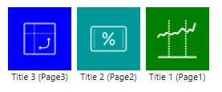

# PowerBI Custom Visual Navigation Menu
A custom visual for simulating a tiled navigation menu:

This custom visual enables navigation to pages in an embedded report.
It's a sample to proove the concept and it's work in progress.

The menu is defined by a dataset specifying the title, icon, background color and navigation page.

The correct data structure is not yet read from the custom properties. 
The label describes the number of records that are passed to the custom visual. Please fill the "categories" and "measure data" fields in order to display any data.